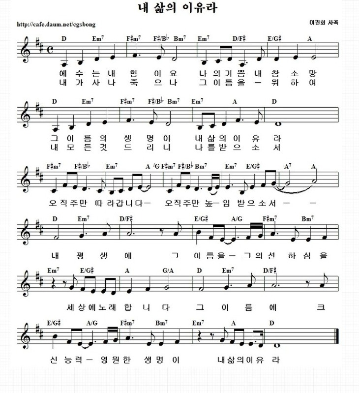

# 아가세 1월 5째주
- 일자: 2023년 1월 29일
- 일시: 12:30 ~ 14:00
- 장소: 교육관 9층

## 진행 순서

### 1. 경배와 찬양
- 찬양 인도: 김태근 집사
- 오늘의 찬양
	- [주님과 같이](#1)
	- [주님과 함께하는](#2)
- 찬양 영상: [유튜브](https://youtube.com/watch?v=4v0oHeJ8-2k&si=EnSIkaIECMiOmarE)

### 2. 대표기도: 김대중 집사

### 3. 말씀: 이동훈 목사
- 참고 본문: 생명의 삶 2023년 1월 29일 [본문보기](#qt)

### 4. 광고
- 오늘은 아가세 종강 모임으로 모입니다. 준비한 음식을 함께 나누며 총회를 진행하고자 합니다.
- 지난 1년 간 아가세 가족 모두 수고 많으셨습니다. 방학 중에도 하나님의 은혜 가운데 거하시기를 기원하며 2023년 개강 모임은 추후 공지하겠습니다.
- 교회 창립 100주년을 맞아 진행 중인 “성경 100권” 필사 운동에 아기세 가족들의 많은 참여 부탁드립니다.

## 함께 기도해요
- 김대중 집사: 아버님이 주님을 영접하시고, 진숙현 지사님의 어께 통증이 치유받도록
- 이승은/정현숙 집사: 자녀(주아, 수한)의 믿음이 잘나고 교회 출석에 열심을 낼 수 있도록
- 황인택 집사: 아버님의 건강을 회복시켜 주시고, 마음을 열어 예수님을 영접할 수 있도록
- 김경미 집사: 딸들의 건강을 지켜주시고 은혜 가운데 잘 자라날 수 있도록
- 배지연 집사: 진로(진학, 수련, 직장)와 관련하여 하나님의 인도하심을 위해

## 악보

### 1 

### 2

## QT

### 디모데를 보내려는 이유 2:19~24
>19 내가 디모데를 속히 너희에게 보내기를 주 안에서 바람은 너희의 사정을 앎으로 안위를 받으려 함이니 
>20 이는 뜻을 같이하여 너희 사정을 진실히 생각할 자가 이밖에 내게 없음이라 
>21 그들이 다 자기 일을 구하고 그리스도 예수의 일을 구하지 아니하되 
>22 디모데의 연단을 너희가 아나니 자식이 아버지에게 함같이 나와 함께 복음을 위하여 수고하였느니라 
>23 그러므로 내가 내 일이 어떻게 될지를 보아서 곧 이 사람을 보내기를 바라고
>24 나도 속히 가게 될 것을 주 안에서 확신하노라 

### 에바브로디도를 보내려는 이유 2:25~30
25 그러나 에바브로디도를 너희에게 보내는 것이 필요한 줄로 생각하노니 그는 나의 형제요 함께 수고하고 함께 군사 된 자요 너희 사자로 내가 쓸 것을 돕는 자라 
26 그가 너희 무리를 간절히 사모하고 자기가 병든 것을 너희가 들은 줄을 알고 심히 근심한지라 
27 그가 병들어 죽게 되었으나 하나님이 그를 긍휼히 여기셨고 그뿐 아니라 또 나를 긍휼히 여기사 내 근심 위에 근심을 면하게 하셨느니라 
28 그러므로 내가 더욱 급히 그를 보낸 것은 너희로 그를 다시 보고 기뻐하게 하며 내 근심도 덜려 함이니라 
29 이러므로 너희가 주 안에서 모든 기쁨으로 그를 영접하고 또 이와 같은 자들을 존귀히 여기라 
30 그가 그리스도의 일을 위하여 죽기에 이르러도 자기 목숨을 돌보지 아니한 것은 나를 섬기는 너희의 일에 부족함을 채우려 함이니라
