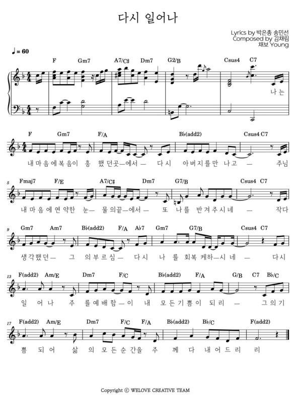
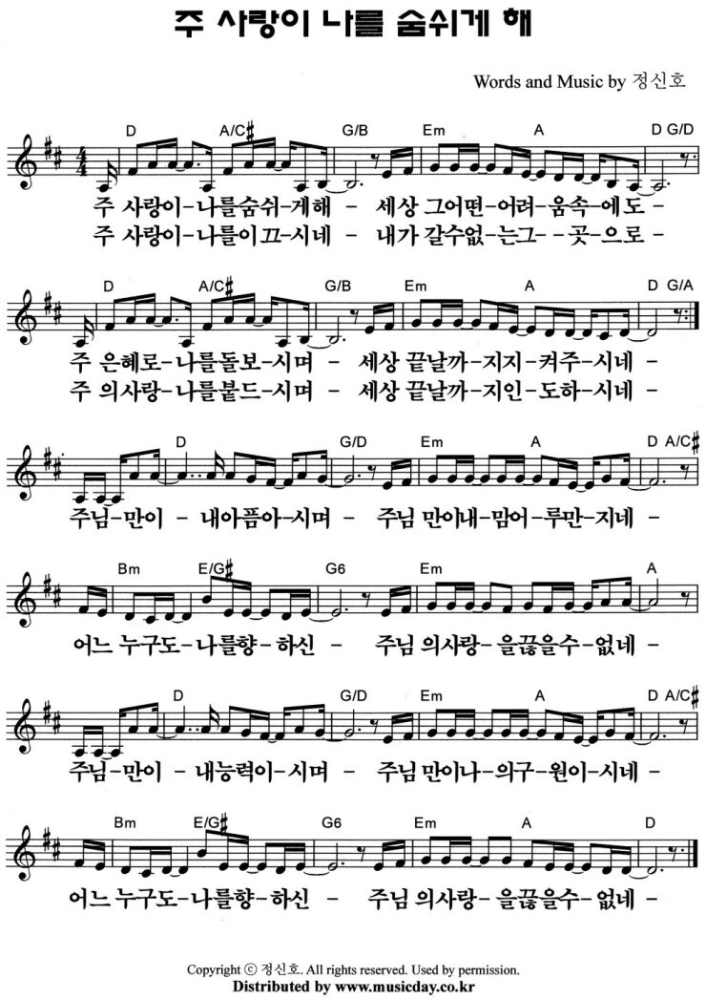

# 아가세 2부
- 일자: 2023년 2월 19일
- 일시: 11시 30분 ~ 12시 40분
- 장소: 교육관 9층

## 진행 순서

### 1. 찬양
- 찬양 인도: 김태근 집사
- 오늘의 찬양: 다시 일어나(We Love) [악보보기](#1){: .label}
- 찬양 영상: [유튜브(새창)](https://www.youtube.com/watch?v=qDyCoSMia48&feature=youtu.be){: .label}

### 2. 대표기도
- 대표기도: 하걸범 집사
- 다음: 정주영 집사

### 3. 말씀
- 말씀: 이동훈 목사

### 4. 안내
- 진행: 하걸범 집사

### 5. 프로그램
- 주제: 아가세 조모임[조편성](people){: .label}
- 다음: 남편, 아내 데이[프로그램](schedule){: .label}

## 초등창작교실
- 주제: 클레이아트 수업
- 담당교사: 김지은, 임장훈
- 시간: 11시 30분 ~ 12시 40분
- 다음: 쿠킹 - 식빵롤 만들기

<!-- - 오늘의 QT: [생명의삶](#qt){: .label} -->

<!-- ### 4. 알림 -->
<!-- - 오늘은 아가세 종강 모임으로 모입니다. 준비한 음식을 함께 나누며 총회를 진행하고자 합니다. -->
<!-- - 지난 1년 간 아가세 가족 모두 수고 많으셨습니다. 방학 중에도 하나님의 은혜 가운데 거하시기를 기원하며 2023년 개강 모임은 추후 공지하겠습니다. -->
<!-- - 교회 창립 100주년을 맞아 진행 중인 “성경 100권” 필사 운동에 아기세 가족들의 많은 참여 부탁드립니다. -->

<!-- ## 함께 기도해요 -->
<!-- - 김대중 집사: 아버님이 주님을 영접하시고, 진숙현 지사님의 어께 통증이 치유받도록 -->
<!-- - 이승은/정현숙 집사: 자녀(주아, 수한)의 믿음이 잘나고 교회 출석에 열심을 낼 수 있도록 -->
<!-- - 황인택 집사: 아버님의 건강을 회복시켜 주시고, 마음을 열어 예수님을 영접할 수 있도록 -->
<!-- - 김경미 집사: 딸들의 건강을 지켜주시고 은혜 가운데 잘 자라날 수 있도록 -->
<!-- - 배지연 집사: 진로(진학, 수련, 직장)와 관련하여 하나님의 인도하심을 위해 -->

---

## 악보

### 1

<!-- ### 2 -->
<!--  -->

<!-- ## QT -->

<!-- ### 디모데를 보내려는 이유 2:19~24 -->

