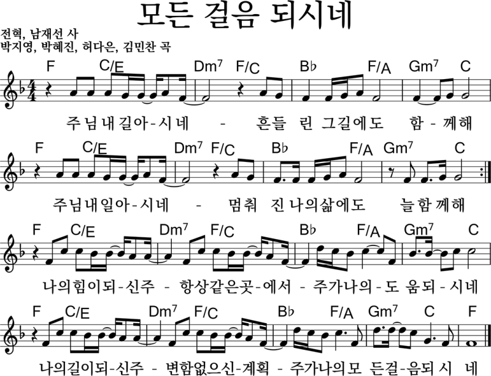

# 아가세 2부
- 🗓️ 일자: 2023년 2월 26일
- 🕦 일시 및 장소
  -  11시 30분: 점식식사 [🍽️ 본관 식당]
  -  12시~13시: 예배와 나눔[⛪ 교육관 9층]

## 예배와 나눔

### 1. 🎤 찬양
- 찬양 인도: 김태근 집사
- 오늘의 찬양:
  - 예수 가장 귀한 그이름  🎵 [악보보기(1)](#1){: .label}
  - 모든 걸음 되시네 🎵 [악보보기(2)](#2){: .label}
- 찬양 영상: 📺 [유튜브(새창)](https://www.youtube.com/playlist?list=PLb8xb_lIoJ_HK2A0LogV1LJuPCdc6u5QD){: .label}

### 2. 🙏 대표기도
- 대표기도: 김춘수 장로 (다음: 정주영 집사)
- 전하는 말: 김춘수 장로
- 간식, 대표기도 일정 [확인 및 수정(구글시트)](https://docs.google.com/spreadsheets/d/1lbI19_aBxfNdhaPLaUOwoYV0HYdjHeSiXNjnpaHt0dw/edit?usp=sharing){: .label}

### 3. 🗣️ 안내
- 진행: 하걸범 집사

### 4. ☕ 나눔
- 진행 행사
  - 👨 남편 데이: 인도 - 김효일 집사 (교육관 9층)
  - 👩 아내 데이: 인도 - 김나리 집사 (외부, 1인당 7천원 지원)

- 모임  주제
  - 분기 별 조 구성
  - 조별 나눔 시 Guidance 수립

- 다음: 잘잘법 묵상 & 토론 [신앙 - 박영선 목사]
- 전체 프로그램 [사업계획](schedule){: .label}

## 🏫 아동스쿨
- 주제: 쿠킹클라스 - 까나페 만들기
- 시간: 12시 ~ 13시
- 담당교사: 김지은, 임장훈
- 다음 주제: 십자가 팔찌 만들기

---

## 악보

### 1

### 2

