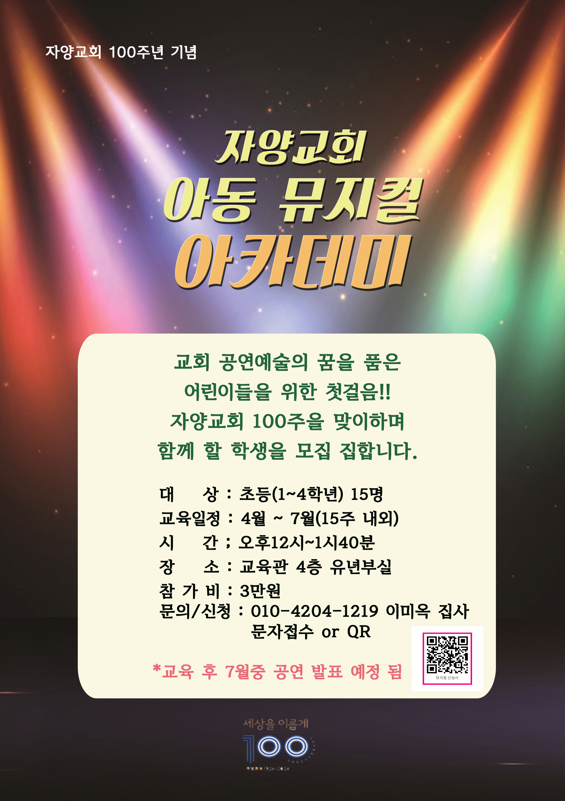
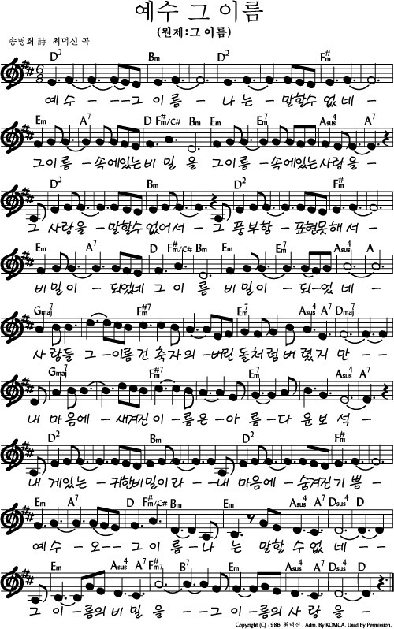

# 아가세 2부
- 🗓️ 일자: 2023년 3월 12일
- 🕦 일시 및 장소
  -  11시 30분: 점식식사 [🍽️ 본관 식당]
  -  12시~13시: 예배와 나눔[⛪ 교육관 9층]

## 예배와 나눔

### 1. 🎤 찬양
- 찬양 인도: 김태근 집사
- 오늘의 찬양
  <!-- - 예수 그 이름 🎵 [악보보기(1)](#1){: .label} -->
  <!-- - 새 힘 얻으리 🎵 [악보보기(2)](#2){: .label} -->
<!-- - 찬양 영상: 📺 [유튜브(새창)](https://www.youtube.com/playlist?list=PLb8xb_lIoJ_HK2A0LogV1LJuPCdc6u5QD){: .label} -->

### 2. 🙏 대표기도 / 🗣️ 안내
- 대표기도: 이미옥 집사 (다음: 이선의 집사)
- 안내: 하걸범 집사

### 3. ☕나눔 / 프로그램
- 주제: 잘잘법 시청 후 조별 나눔 (박영선 목사)
- 다음 주: 아내&남편데이 (3남선교회&여전도회모임)

### 4. 🏫 아동스쿨
- 주제: 스티커볼 만들기
- 시간: 12시 ~ 13시
- 담당교사: 김지은, 임장훈
- 다음 주제: 컵케이크 만들기

### 키즈뮤지컬

- [신청하기(네이버폼)](https://form.office.naver.com/form/responseView.cmd?formkey=NDgwMTA3MWUtY2QyOC00M2E3LWJiZTEtNjNlM2FjODdlM2Zm&sourceId=urlshare){: .label}

## 3월 일정

|일자| 아가세| 아동스쿨 | 대표기도 |
|:---:|:-------------------------------------------|:----|:----:|
| 3/5 | 미디어 묵상&토론-사순절(김학철 교수) | 팔찌만들기 | 황인택 |
| 3/12 | 미디어 묵상&토론- 박영선 목사| 스티커볼 만들기| 이미옥 |
| 3/19 | 아내&남편데이 (3남선교회&여전도회모임)| 컵케이크 만들기| 이선의 |
| 3/26 | 미디어 묵상&토론-김기석 목사| 나무공예| 임서경 |

- 전체 프로그램 [사업계획](schedule){: .label}
- 간식, 대표기도 일정 [확인 및 수정(구글시트)](https://docs.google.com/spreadsheets/d/1lbI19_aBxfNdhaPLaUOwoYV0HYdjHeSiXNjnpaHt0dw/edit?usp=sharing){: .label}

---

## 악보

### 1

### 2

