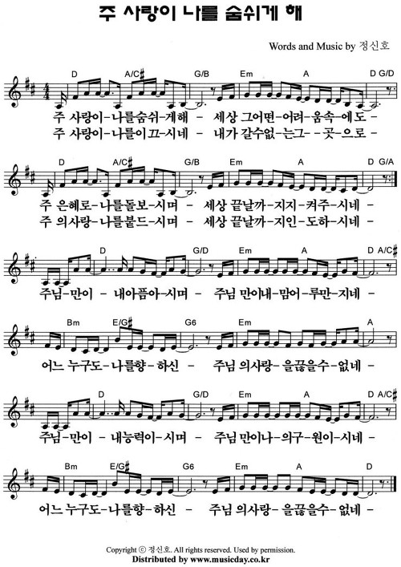
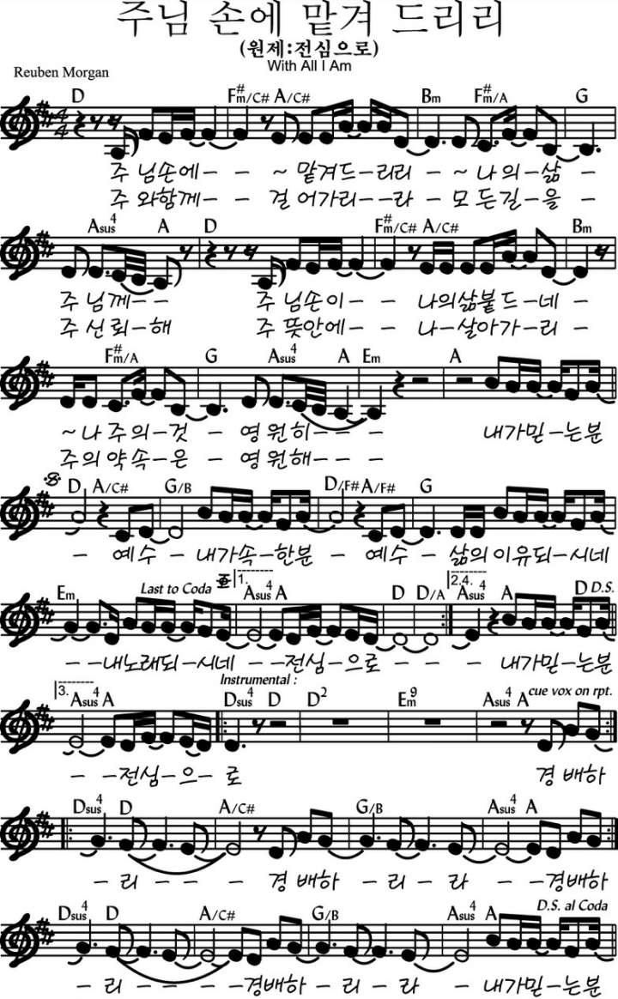

# 아가세 2부
- 🗓️ 일자: 2023년 3월 26일
- 🕦 일시 및 장소
  -  11시 30분: 점식식사 [🍽️ 본관 식당]
  -  12시~13시: 예배와 나눔[⛪ 교육관 9층]

## 예배와 나눔

### 1. 🎵 찬양
- 찬양 인도: 김태근 집사
- 오늘의 찬양 [악보보기](#score){: .label}
  - 주 사랑이 나를 숨쉬게 해
  - 전심으로 (주님 손에 맡겨 드리리)
- 찬양 영상: 📺 [유튜브(새창)](https://www.youtube.com/watch?v=qHQHBXvSs3o){: .label}

### 2. ☕ 아가세 프로그램
- 대표기도: 임서경 집사 (다음: 조미현 집사)
- 안내: 하걸범 집사
- 나눔: 미디어 묵상&토론-김기석 목사

### 3. 🏫 아동스쿨
- 주제: 나무공예
- 담당교사: 김지은, 임장훈
- 시간: 12시 ~ 13시

### 전체 일정
- 전체 프로그램 [사업계획](schedule){: .label}
- 간식, 대표기도 일정 [확인 및 수정(구글시트)](https://docs.google.com/spreadsheets/d/1lbI19_aBxfNdhaPLaUOwoYV0HYdjHeSiXNjnpaHt0dw/edit?usp=sharing){: .label}

---

## 악보

### score

