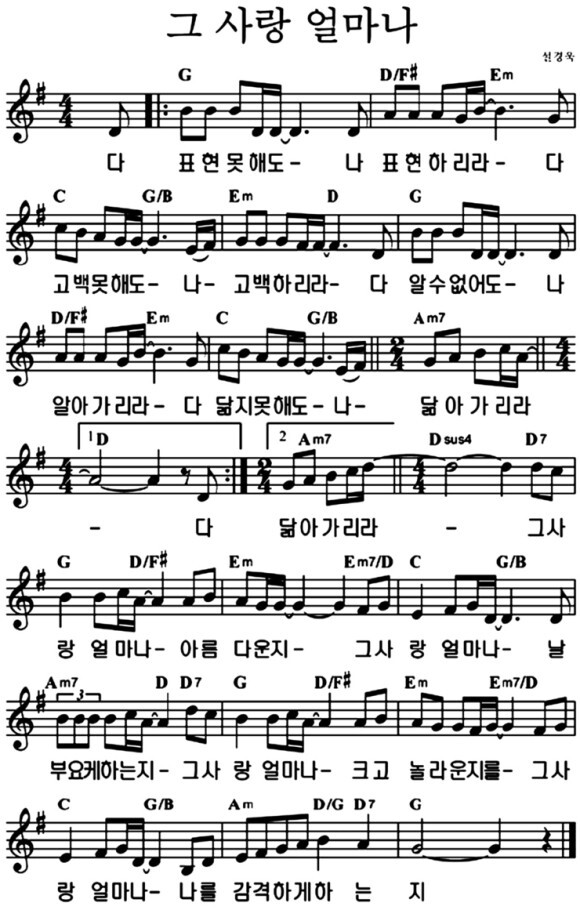

# 아가세 2부
- 🗓️ 일자: 2023년 4월 9일
- 🕦 일시 및 장소
  -  11시 30분: 점식식사 [🍽️ 본관 식당]
  -  12시~13시: 예배와 나눔[⛪ 교육관 9층]

## 예배와 나눔

### 1. 🎵 찬양
- 찬양 인도: 김태근 집사
- 오늘의 찬양 [악보보기](#score){: .label}
  - 예수 살아계신 주+ 무덤이기신 예수(후렴)
  - 십자가를 참으신 + 그 사랑 얼마나(후렴)
- 찬양 영상: 📺 [유튜브(새창)](https://youtu.be/mUHi_GPHZGk?list=PLb8xb_lIoJ_FitO_qResp3ydfuT_RVLRg){: .label}

### 2. ☕ 아가세 프로그램
- 대표기도: 정주영 집사 (다음: 진숙현 집사)
- 안내: 하걸범 집사
- 간식: 서동현/조미현 가정
- 특강: 교회 교육과 부모신앙 (박성식 목사님)

### 3. 🏫 아동 뮤지컬 아카데미
- 담당교사: 박수경 집사
- 시간: 12시 ~ 13시 40분

## 4월 일정

|일자| 아가세| 대표기도 |
|:---:|:-------------------------------------------|:----:|
| 4/2 | 교회 교육과 부모신앙 (박성식 목사) | 조미현 |
| **4/9** | **교회 교육과 부모신앙 (박성식 목사)** | **정주영** |
| 4/16 | 신앙교육을 위한 부모신앙 (유영림 교수) | 진숙현|
| 4/22(토) | 봄 나들이 | - |
| 4/23 | 아내/남편데이 (3남선교, 7여전도) | 노동민 |
| 4/30 | 미정 | 미정 |

### 전체 일정
- 전체 프로그램 [사업계획](schedule){: .label}
- 간식, 대표기도 일정 [확인 및 수정(구글시트)](https://docs.google.com/spreadsheets/d/1lbI19_aBxfNdhaPLaUOwoYV0HYdjHeSiXNjnpaHt0dw/edit?usp=sharing){: .label}

---

## 악보

### score

