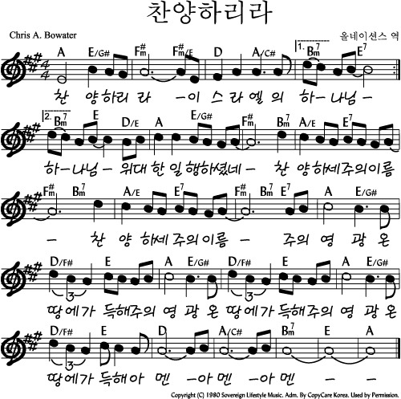
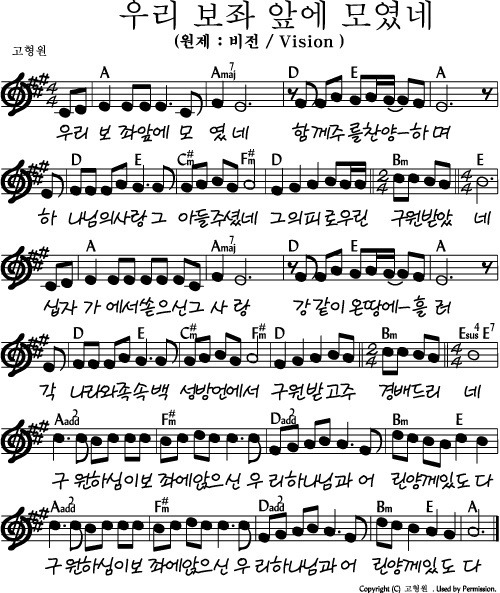

# 아가세 2부
- 🗓️ 일자: 2023년 5월 28일
- 🕦 일시 및 장소
  -  11시 30분: 점식식사 [🍽️ 본관 식당]
  -  12시~13시: 예배와 나눔[⛪ 교육관 9층]

## 예배와 나눔

### 1. 🎵 찬양
- 찬양 인도: 김태근 집사
- 찬양하리라 [악보보기](#score){: .label}
- 우리 보좌 앞에 모였네 [악보보기](#score){: .label}

### 2. ☕ 아가세 프로그램
- 대표기도: 진숙현 집사 (다음: 김수진 집사)
- 안내: 하걸범 집사
- 말씀: 세계선교회 (장은철 집사)

### 3. 🏫 아동 뮤지컬 아카데미
- 담당교사: 박수경 집사
- 시간: 12시 ~ 13시 40분

## 5월 일정

|일자| 아가세| 대표기도 |
|:---:|:-------------------------------------------|:----:|
| 5/7 | 휴강 | - |
| 5/14| 조별모임| 이영희|
| 5/21| 아내/남편데이(남여선교회) | 김효일 |
|**5/28**| **세계선교회(장은철)**| **진숙현** |

### 전체 일정
- 전체 프로그램 [사업계획](schedule){: .label}
- 간식, 대표기도 일정 [확인 및 수정(구글시트)](https://docs.google.com/spreadsheets/d/1lbI19_aBxfNdhaPLaUOwoYV0HYdjHeSiXNjnpaHt0dw/edit?usp=sharing){: .label}

---

## 악보

### score

