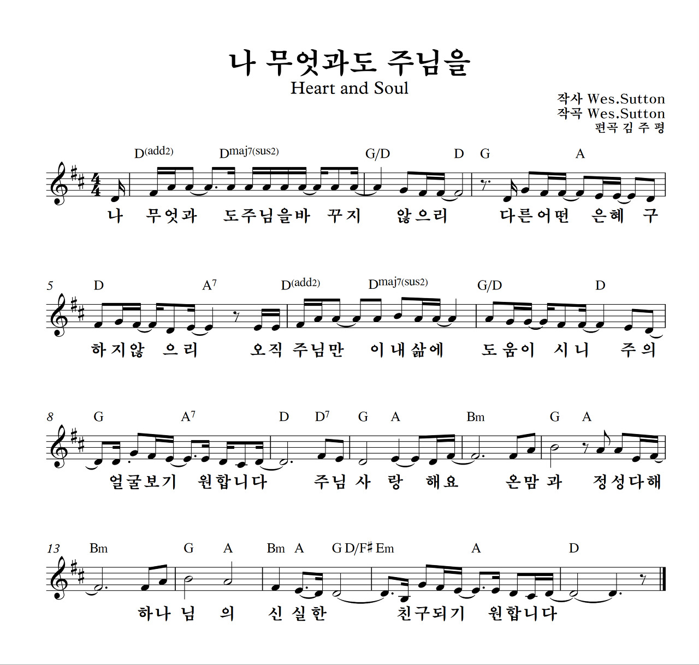
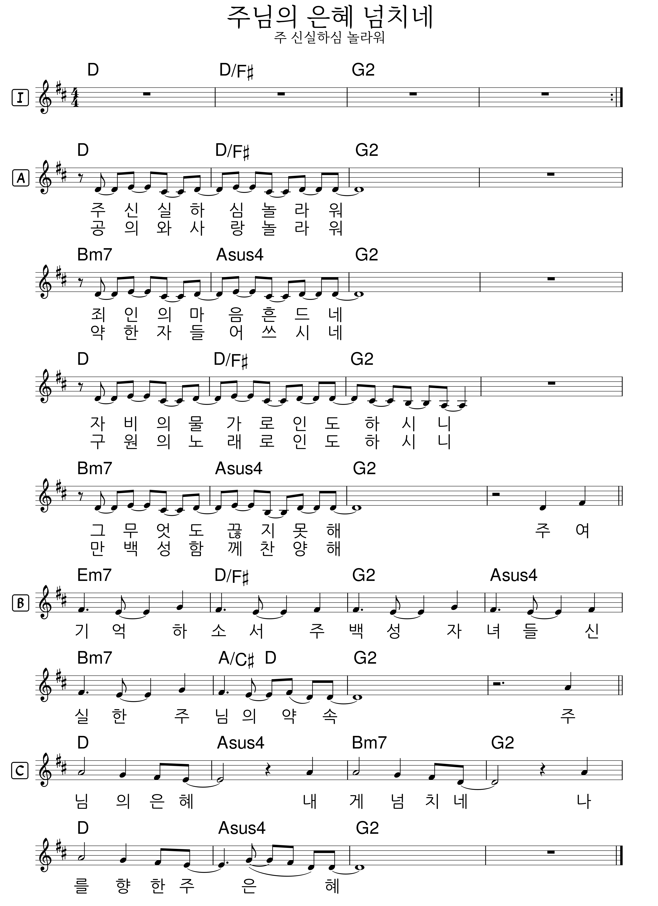

# 아가세 2부
- 🗓️ 일자: 2023년 6월 18일
- 🕦 일시 및 장소
  -  11시 30분: 점식식사 [🍽️ 본관 식당]
  -  12시~13시: 예배와 나눔[⛪ 교육관 9층]

## 예배와 나눔

### 1. 🎵 찬양
- 찬양 인도: 정주영 집사
- 나 무엇과도 주님을 [악보보기](#score){: .label}
- 주님의 은혜 넘치네(주 신실하신 놀라워) [악보보기](#score){: .label}

### 2. ☕ 아가세 프로그램
- 대표기도: 김태근 집사 (다음: 김대중 집사)
- 안내: 하걸범 집사
- 말씀: 명화로 읽는 신약 성경 (이동훈 목사)
- 간식: 황인택, 임서경

### 3. 🏫 아동 뮤지컬 아카데미
- 담당교사: 박수경 집사
- 시간: 12시 ~ 13시 40분

## 6월 일정

|일자| 아가세| 대표기도 |
|:---:|:-------------------------------------------|:----:|
| 6/4 | 명화로 읽는 신약 성경 |김수진 |
| 6/11 | 명화로 읽는 신약 성경 | 허윤경 |
| **6/18** | **명화로 읽는 신약 성경** | **김태근** |
| 6/25 | 아내/남편데이(남여선교회) | 김대중 |

### 전체 일정
- 전체 프로그램 [사업계획](schedule){: .label}
- 간식, 대표기도 일정 [확인 및 수정(구글시트)](https://docs.google.com/spreadsheets/d/1lbI19_aBxfNdhaPLaUOwoYV0HYdjHeSiXNjnpaHt0dw/edit?usp=sharing){: .label}

---

## 악보

### score

