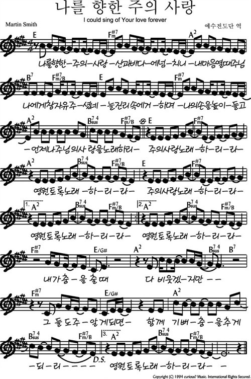
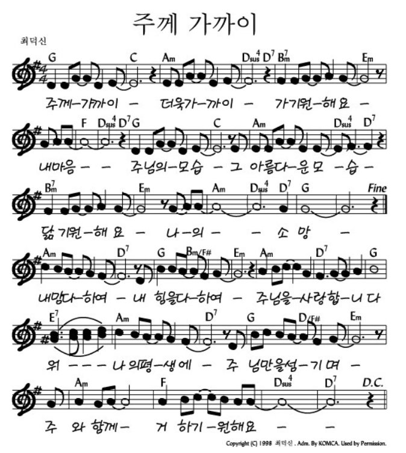

# 아가세 2부
- 🗓️ 일자: 2023년 8월 27일
- 🕦 일시: 12:00 ~ 13:30
- ⛪ 장소: 교육관 9층

## 예배와 나눔

### 1. 🕦  시간표
|시간| 내용 | 구분|
|:---:|:-------------------------------------------|:----:|
| 12:00 ~ 12:30 | 찬양 | 김태근, 정주영 집사|
| 12:30 ~ 12:40 | 대표기도 | 황인택(다음:  |
| 12:30 ~ 12:40 | 광고 및 안내| 하걸범 회장|
| 12:40 ~ 13:30 | 조별 나눔 | 목사님, 진행자|
| 아동스쿨 | | |

### 전체 일정
- 전체 프로그램 [사업계획](schedule){: .label}
- 간식, 대표기도 일정 [확인 및 수정(구글시트)](https://docs.google.com/spreadsheets/d/1lbI19_aBxfNdhaPLaUOwoYV0HYdjHeSiXNjnpaHt0dw/edit?usp=sharing){: .label}

---

### 🎵 찬양

- 나를 향한 주의 사랑

- 주께 가까이

