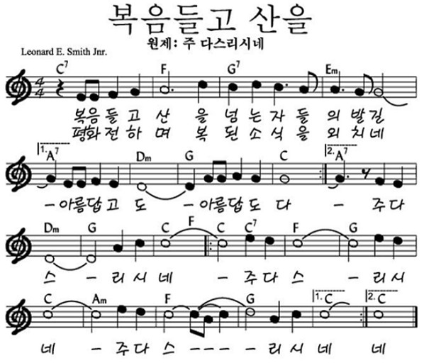
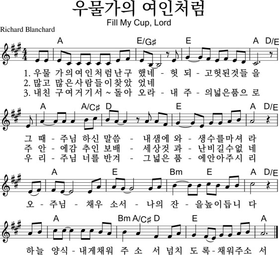

## 아가세 2부
- 일자: 2023년 8월 27일
- 일시: 12:00 ~ 13:30
- 장소: 교육관 9층

## 시간표

|시간| 내용 | 진행자|
|:---:|:-------------------------------------------|:----:|
| 12:00 ~ 12:30 | 찬양 | 김태근, 정주영 집사|
| 12:30 ~ 12:35 | 대표기도 | 이선의(다음: 이미옥) |
| 12:35 ~ 12:40 | 광고 및 안내| 하걸범 회장|
| 12:40 ~ 13:30 | 하반기 일정 수립 | 전체 |

- 아동스쿨: 미니버거 만들기 (이미옥 집사)

## 전체 일정

- 전체 프로그램 [사업계획](schedule){: .label}
- 간식, 대표기도 일정 [확인 및 수정(구글시트)](https://docs.google.com/spreadsheets/d/1lbI19_aBxfNdhaPLaUOwoYV0HYdjHeSiXNjnpaHt0dw/edit?usp=sharing){: .label}

## 찬양

