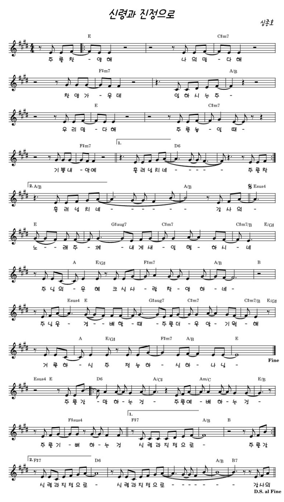
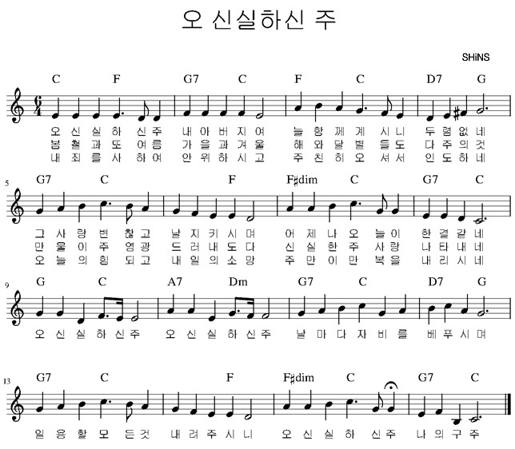

## 아가세 2부
- 일자: 2023년 9월 3일
- 일시: 12:20 ~ 13:30
- 장소: 교육관 9층

## 시간표

|시간| 내용 | 진행자|
|:---:|:-------------------------------------------|:----:|
| 12:20 ~ 12:30 | 찬양 | 김태근, 정주영 집사|
| 12:30 ~ 12:40 | 대표기도 | 이미옥(다음: 임서경) |
| 12:40 ~ 12:50 | 광고 및 안내| 하걸범 회장|
| 12:50 ~ 13:30 | 말씀, 나눔 | 전체 |

- 아동스쿨: 체육활동 (7층, 임장훈 선생님)

## 전체 일정

- 전체 프로그램 [사업계획](schedule){: .label}
- 간식, 대표기도 일정 [확인 및 수정(구글시트)](https://docs.google.com/spreadsheets/d/1lbI19_aBxfNdhaPLaUOwoYV0HYdjHeSiXNjnpaHt0dw/edit?usp=sharing){: .label}

## 찬양

