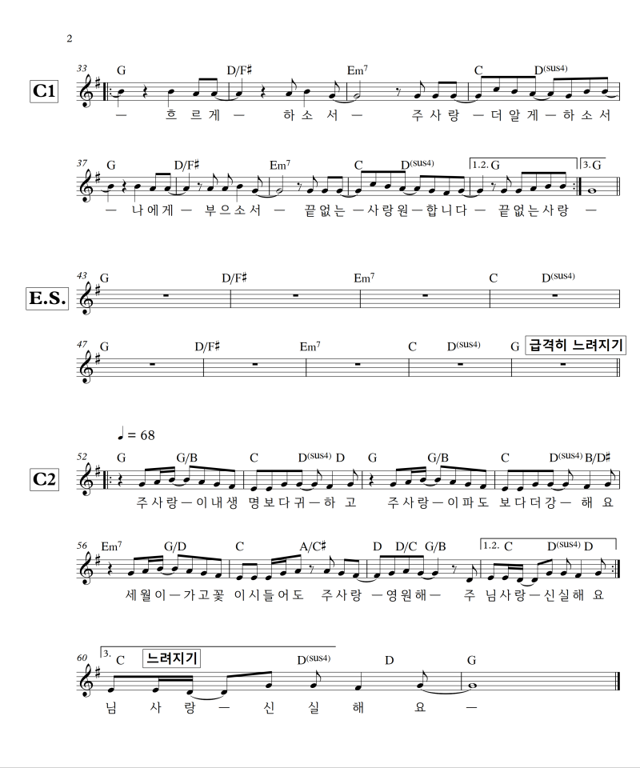

## 아가세 2부
- 일자: 2023년 10월 22일
- 일시: 12:20 ~ 13:40
- 장소: 교육관 9층

## 시간표

|시간| 내용 | 진행자|
|:---:|:-------------------------------------------|:----:|
| 12:20 ~ 12:30 | 찬양 | 김태근, 정주영 집사|
| 12:30 ~ 12:40 | 대표기도 이영희 | (다음: 김수진) |
| 12:30 ~ 12:40 | 광고 및 안내| 하걸범 회장|
| 12:40 ~ 13:40 | 말씀 나눔| |

- 아동스쿨: 뮤지컬 연습

## 전체 일정

- 전체 프로그램 [사업계획](schedule){: .label}
- 간식, 대표기도 일정 [확인 및 수정(구글시트)](https://docs.google.com/spreadsheets/d/1lbI19_aBxfNdhaPLaUOwoYV0HYdjHeSiXNjnpaHt0dw/edit?usp=sharing){: .label}

## 찬양

