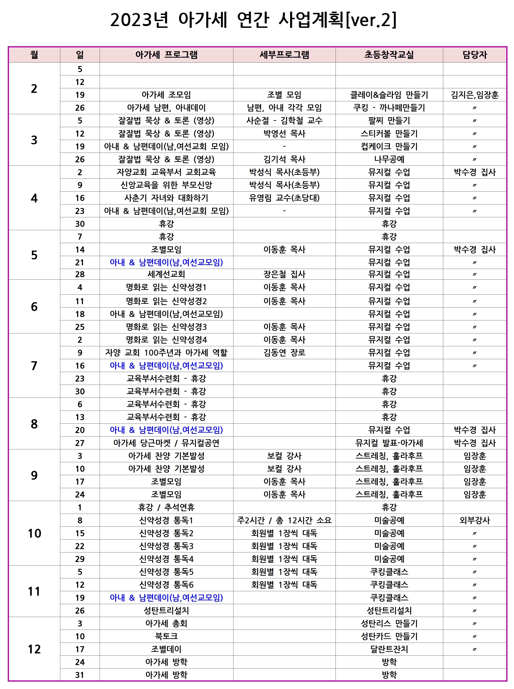

# 2023년 주요일정
<!-- | 일시 | 행사 | 비고 | -->
<!-- |----|----|----| -->
<!-- | 1월 1일 (일) 12:00 | 방학 | 새해 | -->
<!-- | 1월 6일 (금) 6:00 | 특별새벽기도 | 3남 합동 | -->
<!-- | 1월 15일 (일) 12:30 | 크리스마스트리 철거 | 우천취소 | -->
<!-- | 1월 22일 (일) 12:30 | 방학 | 설연휴 | -->

- 사업계획은 변경될 수 있습니다.
- updated: 2023-04-28
